# Matplotlib-Challenge
### Pymaceuticals, Inc. - Squamous Cell Carcinoma Study
 
## Introduction
In the most recent animal study, 249 mice identified with squamous cell carcinoma (SCC) tumors were subjected to various drug regimens, with a primary focus on evaluating the efficacy of Pymaceuticals' leading drug, Capomulin. Over the span of 45 days, the development and measurement of tumor progression were meticulously observed. The objective of this comprehensive study was to assess the performance of Capomulin in comparison to other treatment regimens, providing valuable insights that can shape the future of anti-cancer medications.

This analysis uses statistical methods gain insight about each drug's performance. 

## Imports
    # Dependencies and Setup
    import matplotlib.pyplot as plt
    import pandas as pd
    import scipy.stats as st
    from scipy.stats import linregress
    import numpy as np
## ETL 
Study data files

    mouse_metadata_path = "../data/Mouse_metadata.csv"
    study_results_path = "../data/Study_results.csv"

Read the mouse data and the study results
    
    mouse_metadata = pd.read_csv(mouse_metadata_path)
    study_results = pd.read_csv(study_results_path)

Combine the data into a single DataFrame
    
    tumor_df = pd.merge(study_results, mouse_metadata, how="left", on=["Mouse ID", "Mouse ID"])

Display the data table for preview

    tumor_df.head()

Check number of mice

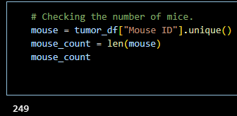

Drop duplicates and confirm
    
    mouse_dup = tumor_df.loc[tumor_df.duplicated(subset=["Mouse ID", "Timepoint"]), "Mouse ID"].unique()

    Output: array(['g989'], dtype=object)

    cl_mouse_df = tumor_df[tumor_df["Mouse ID"] != "g989"]

Confirm duplicates are dropped

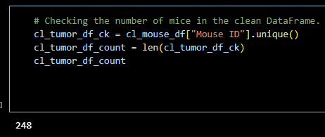

## Analysis
Use groupby and summary statistical methods to calculate the following properties of each drug regimen: mean, median, variance, standard deviation, and SEM of the tumor volume. 

    gr_drug = cl_mouse_df.groupby(["Drug Regimen"])
    gr_drug_mean = gr_drug["Tumor Volume (mm3)"].mean()
    gr_drug_mean = gr_drug["Tumor Volume (mm3)"].mean()
    gr_drug_median = gr_drug["Tumor Volume (mm3)"].median()
    gr_drug_var = gr_drug["Tumor Volume (mm3)"].var()
    gr_drug_std = gr_drug["Tumor Volume (mm3)"].std()
    gr_drug_sem = gr_drug["Tumor Volume (mm3)"].sem()

Assemble the resulting series into a single summary DataFrame. 

    gr_drug_df = pd.DataFrame({ "Mean Tumor Volume" : gr_drug_mean, 
                                "Median Tumor Volume" : gr_drug_median,
                                "Tumor Volume Variance" : gr_drug_var, 
                                "Tumor Volume Std. Dev." : gr_drug_std, 
                                "Tumor Volume Std. Err." : gr_drug_sem})

Alternate statistical method - aggregation produces summary statistics in a single line

    gr_drug_agg_df = cl_mouse_df[["Drug Regimen", "Tumor Volume (mm3)"]].groupby(["Drug Regimen"]).agg(["mean", "median", "var", "std", "sem"])

## Results
### Bar plots
#### **List drugs**

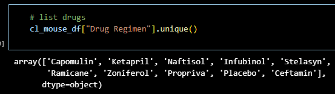

#### **List timepoints**

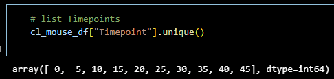

#### **Value count of drug regimen**

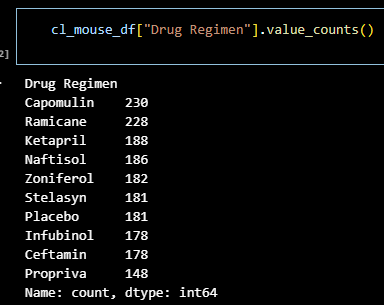

Bar plot of Timepoints vs Drug regimen using Pandas

    cl_mouse_df.groupby(["Drug Regimen"])["Timepoint"].count().reset_index(name="Timepoint").plot.bar(x="Drug Regimen",y="Timepoint",legend=False)
    plt.ylabel("# of Observed Mouse Timepoints")

 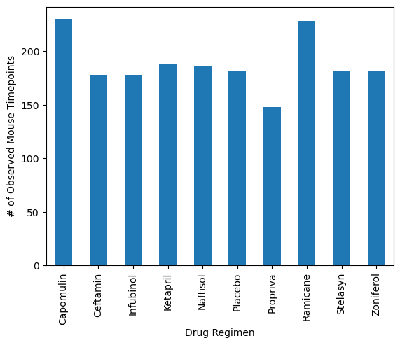

Bar plot of Timepoints vs Drug regimen using pylot

    plot = cl_mouse_df.groupby(["Drug Regimen"])["Timepoint"].count().reset_index(name="Timepoint")
    tm_pt = plot["Timepoint"]
    x_axis = np.arange(len(tm_pt))
    dr_reg = plot["Drug Regimen"]

    plt.bar(x_axis,tm_pt,color="b")
    tick_locations = [x for x in x_axis]
    plt.xticks(tick_locations,dr_reg)
    #labels
    plt.xlabel("Drug Regimen")
    plt.ylabel("# of Observed Mouse Timepoints")
    plt.xticks(rotation="vertical")

 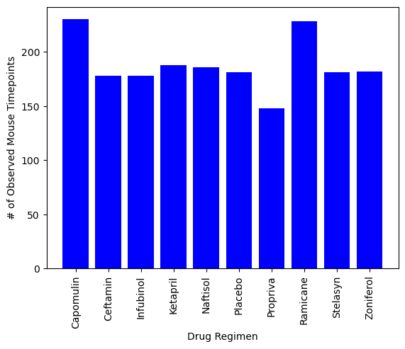

### Pie plots
#### **Value count of sex**

 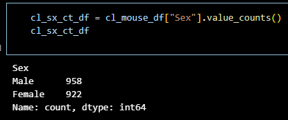

Pie plot of mouse ID vs sex using pandas

    cl_mouse_df.groupby(["Sex"])["Mouse ID"].count().plot.pie(y=["Sex"], label="",autopct="%1.1f%%")
    plt.ylabel("Sex")

 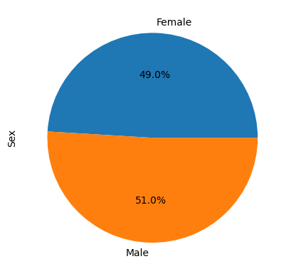

Pie plot of mouse ID vs sex using pyplot

    pie_plot = cl_mouse_df.groupby(["Sex"])["Mouse ID"].count().reset_index(name = "Sex - Mouse ID")
    sx = pie_plot["Sex"]
    Count = pie_plot["Sex - Mouse ID"]
    plt.pie(Count, labels = sx, autopct = "%1.1f%%")
    plt.ylabel("Sex")

### Quartiles, Outliers, and boxplots
Create df for all drug regimens

    Capomulin = cl_mouse_df.loc[cl_mouse_df["Drug Regimen"] == "Capomulin", : ]
    Ramicane = cl_mouse_df.loc[cl_mouse_df["Drug Regimen"] == "Ramicane", : ]
    Infubinol = cl_mouse_df.loc[cl_mouse_df["Drug Regimen"] == "Infubinol", : ]
    Ceftamin = cl_mouse_df.loc[cl_mouse_df["Drug Regimen"] == "Ceftamin", : ]

Concatenate in treatment df

    treatments = [Capomulin, Ramicane, Infubinol, Ceftamin]
    trt_df = pd.concat(treatments)

Find the last timepoint for each mouse into df

    gr_ID = cl_mouse_df.groupby(["Mouse ID"])
    last_tp = gr_ID["Timepoint"].max()
    last_tp.head()

Merge treatment df and mouse timepoint df

    mg_trt_lt = pd.merge(trt_df, last_tp, on = "Mouse ID")  

Filter using a boolean for the last time == 'true'

    mg_trt_lt["Last Time"] = mg_trt_lt["Timepoint_x"] == mg_trt_lt["Timepoint_y"]
    mg_trt_lt.head()
    mg_trt_lt.drop(mg_trt_lt.loc[mg_trt_lt["Last Time"] == False].index , inplace = True)
    mg_trt_lt

Create summary df

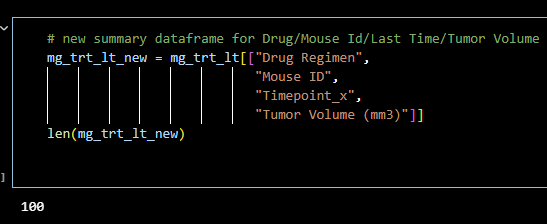

Use list comprehension with summary to analyze tumor volume per drug regimen and for outliers

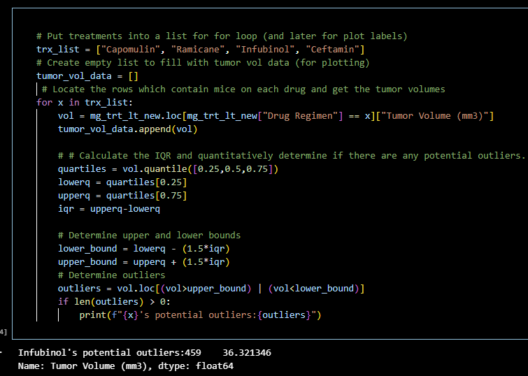

Generate boxplot for treatments and outliers

    plt.boxplot(tumor_vol_data, labels = trx_list, flierprops={'marker': 'o', 
                                                            'markersize': 10, 
                                                            'markerfacecolor': 'red'})
    plt.ylabel("Final Tumor Volume (mm3)")

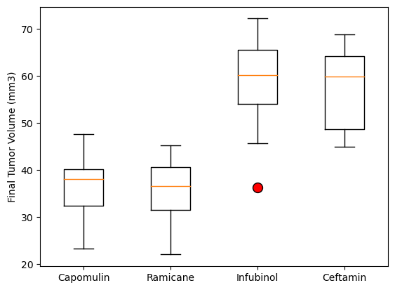

### Line and scatter plot
Create line plot using a single mouse (b128) to identify tumor size vs timepoint

    b128_mouse = cl_mouse_df.loc[cl_mouse_df["Mouse ID"] == "b128", : ]
    x_axis = b128_mouse["Timepoint"]
    y_axis = b128_mouse["Tumor Volume (mm3)"]
    plt.title("Capomulin treatment of mouse b128")
    plt.plot(x_axis, y_axis, color= "blue")
    plt.xlabel("Timepoint (days)")
    plt.ylabel("Tumor Volume (mm3)")

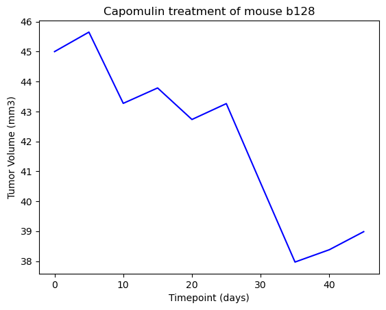

Generate scatter plot of mouse weight vs average observed tumor

    #gather all mice with Capomulin treatment
    mouse_cap = cl_mouse_df.loc[cl_mouse_df["Drug Regimen"] == "Capomulin", : ]
    #average individual mouse weights
    mouse_ID = mouse_cap.groupby("Mouse ID")
    #weight with Capomulin treatment
    weight = mouse_ID["Weight (g)"].mean()
    av_tumor_vol = mouse_ID["Tumor Volume (mm3)"].mean()

    plt.scatter(weight,av_tumor_vol)
    plt.xlabel('Weight (g)')
    plt.ylabel('Average Tumor Volume (mm3)')
    plt.show()

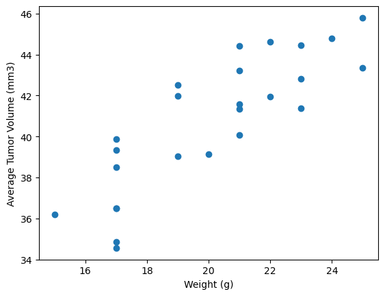

### Correlation and Linear Regression
Generate correlation coefficient and linear regression model by plotting

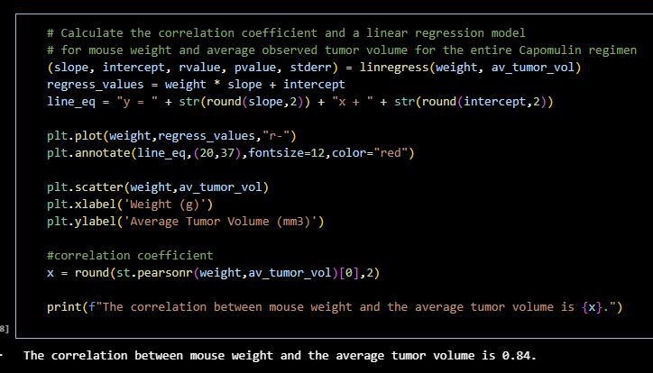
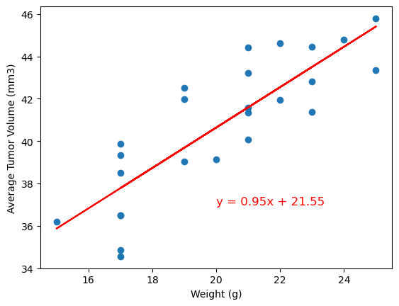

## Conclusion

When analysizing the data, several observations were made. First, the drugs Capomulin and Ramicane had over 200 observed timepoint, while the rest of the drugs tested were below this threshold. Second, the sex of the mice were almost equal: 51% male and 49% female. Third, using the interquartile range, it was determined that there was only one observation of an outlier which was within the drug Infubinol category. Fourth, mouse b128 showed a consistent decrease in tumor volume throughout the timepoint observations. Lastly, using the correlation coefficient and linear regression, the correlation coefficient is 0.84, which means there is a strong relationship between the mouse weight and the average tumor size in the Capomulin drug group. 

## Resources

 Find Mouse ID duplicates - How do I get a list of all the duplicate items using pandas in python? (Feb 20, 2013). StackOverflow. Website. URL. https://stackoverflow.com/questions/14657241/how-do-i-get-a-list-of-all-the-duplicate-items-using-pandas-in-python

 Grouping to find duplicate columns - Grouping by multiple columns to find duplicate rows pandas. (Oct 9, 2017). StackOverflow. Website. URL https://stackoverflow.com/questions/46640945/grouping-by-multiple-columns-to-find-duplicate-rows-pandas

#### Not equal filtering- Pandas: Filter by Column Not Equal to Specific Values. (Feb 10, 2023). Statology. Website. URL https://www.statology.org/pandas-filter-by-column-value-not-equal/#:~:text=Note%3A%20The%20symbol%20!%3D,%E2%80%9Cnot%20equal%E2%80%9D%20in%20pandas.

#### Merging dataframes - Merge, join, concatenate and compare. (2023). pandas. Website. URL https://pandas.pydata.org/docs/user_guide/merging.html

#### Concantenating dataframes - How To Concatenate Two or More Pandas DataFrames? (Nov 2. 2022). GeeksforGeeks. Website. URL https://www.geeksforgeeks.org/how-to-concatenate-two-or-more-pandas-dataframes/

#### Dropping rows using Boolean filter - How to Drop Pandas Rows Based on Index Condition (True/False). (Apr 2, 2023). StackOverflow. Webiste. URL https://stackoverflow.com/questions/66923323/how-to-drop-pandas-rows-based-on-index-condition-true-false

#### Formating plot - How to change outlier point symbol in Python matplotlib.pyplot. (Jan 9, 2021). StackOverflow. Website. URL https://stackoverflow.com/questions/65648502/how-to-change-outlier-point-symbol-in-python-matplotlib-pyplot

